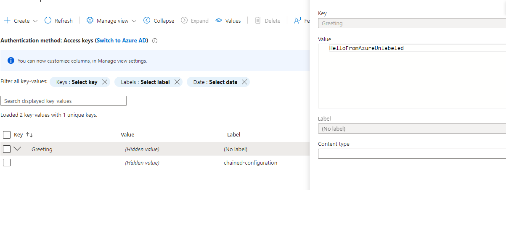
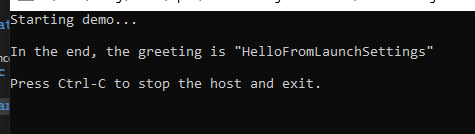

# What

This project demonstrates Microsoft's chained configuration behavior for .NET generic host apps.

Uses NET 6.0 and the generic host builder in a console app, with a "Greeting" property that is overridden with each chain in the configuration.

## Behavior

This is the order in which each chained configuration provider is applied.  Last one wins.

1. Environment variable
1. AppSettings.json
1. AppSettings.{{DOTNET_ENVIRONMENT}}.json
1. Command-line argument
1. LaunchSettings.json (if DOTNET_ENVIRONMENT is "Development" and running from Visual Studio)
1. Azure App Configuration

# Why

Sometimes understanding the chained configuration and what overrides what can be a bigger learning curve than desired.

This demo is to help with your understanding of the order of the chained configuration.

# How

## Instructions

1. Clone this Gitlab project to your local
1. Bring up to Visual Studio
1. Follow the use cases, below
1. Explore to your heart's content

## Prerequisites

1. 1. A CLi of your choice (see more below)
1. Azure subscription (optional, see details below)
1. Visual Studio

### Azure App Config

The Azure configuration part of this demo uses Azure App Configuration access, which is currently free for one resource.

If using this part of the demo, you must setup your Azure subscription and environment prior to launching the demo.

I used the "Greeting" configurable property, one with a label, one without.  If you want to use these, or just one or the other, you will need to add them to your Azure App Config.

The labeled one must match "chained-configuration" per the existing code.



You must also uncomment the `AddAzureAppConfiguration` section in `Program.cs`.

### Command-Line

Familiarity with a command-line is required.  Examples are based on Git Bash for Windows, but can easily be mapped for Powershell or CMD.

## Use Cases

These assume a bash terminal.  Convert to commands for your favorite terminal/Powershell/CMD window.

These work backwards from Azure App Config, that overrides all previous settings, to the lowest priority in the chain.

When running from the command-line, clean (with no environment variables set):

### 6. Azure App Config Trumps All

With the AzureAppConfiguration section of `Program.cs` uncommented,

 ```
 ~/source/repos/ChainedConfigurationDemo/pub  master
 └─➤ cd ..; dotnet publish -o pub --nologo --verbosity quiet; cd pub

 ~/source/repos/ChainedConfigurationDemo/pub  master
 └─➤ ./ChainedConfigurationDemo.exe Greeting=HelloFromArgs
Starting demo...

In the end, the greeting is "HelloFromAzure"

Press Ctrl-C to stop the host and exit.
```

### 5. LaunchSettings.Json

With the AzureAppConfiguration section of `Program.cs` commented, inside Visual Studio, run the app in Debug.



### 4. Command-Line Argument

With Azure commented out, and no DOTNET_ENVIRONMENT set, not launching from Visual Studio's launchSettings,


```
 ~/source/repos/ChainedConfigurationDemo/pub  master
 └─➤ cd ..; dotnet publish -o pub --nologo --verbosity quiet; cd pub

 ~/source/repos/ChainedConfigurationDemo/pub  master
 └─➤ ./ChainedConfigurationDemo.exe Greeting=HelloFromArgs
Starting demo...

In the end, the greeting is "HelloFromArgs"

Press Ctrl-C to stop the host and exit.
```

### 3. AppSettings.{{DOTNET_ENVIRONMENT}}.json

This app is configured such that if the DOTNET_ENVIRONMENT is not set, or is set to something other than "Development" or "Test", the configuration building falls through to appsettings.json if the property exists in it, and so on -- like, for example, if DOTNET_ENVIRONMENT is set to "Production".  

#### 3a. AppSettings.Development.json

- With the AzureAppConfiguration section of `Program.cs` commented
- With no arguments
- With DOTNET_ENVIRONMENT set
- From the command line (launchSettings not used)

```
 ~/source/repos/ChainedConfigurationDemo/pub  master
 └─➤ cd ..; dotnet publish -o pub --nologo --verbosity quiet; cd pub

 ~/source/repos/ChainedConfigurationDemo/pub  master
 └─➤ export DOTNET_ENVIRONMENT=Development

 ~/source/repos/ChainedConfigurationDemo/pub  master
 └─➤ ./ChainedConfigurationDemo.exe
Starting demo...

In the end, the greeting is "HelloFromAppSettings.Development"

Press Ctrl-C to stop the host and exit.
```
#### 3b. AppSettings.Test.json
- With the AzureAppConfiguration section of `Program.cs` commented
- With no arguments
- With DOTNET_ENVIRONMENT set
- From the command line (launchSettings not used)

```
 ~/source/repos/ChainedConfigurationDemo/pub  master
 └─➤ cd ..; dotnet publish -o pub --nologo --verbosity quiet; cd pub

 ~/source/repos/ChainedConfigurationDemo/pub  master
 └─➤ export DOTNET_ENVIRONMENT=Test

 ~/source/repos/ChainedConfigurationDemo/pub  master
 └─➤ ./ChainedConfigurationDemo.exe
Starting demo...

In the end, the greeting is "HelloFromAppSettings.Test"

Press Ctrl-C to stop the host and exit.
```

### 2. AppSettings.json

```
 ~/source/repos/ChainedConfigurationDemo/pub  master
 └─➤ unset DOTNET_ENVIRONMENT

 ~/source/repos/ChainedConfigurationDemo/pub  master
 └─➤ ./ChainedConfigurationDemo.exe
Starting demo...

In the end, the greeting is "HelloFromAppSettings"

Press Ctrl-C to stop the host and exit.
```

With the app's current configuration, this is the same result as in production.

### 4. Environment Variable

```
 ~/source/repos/ChainedConfigurationDemo/pub  master
 └─➤ export Greeting=HelloFromOperatingEnvironment

 ~/source/repos/ChainedConfigurationDemo/pub  master
 └─➤ ./ChainedConfigurationDemo.exe
Starting demo...

In the end, the greeting is "HelloFromOperatingEnvironment"

Press Ctrl-C to stop the host and exit.
```

(make sure to `unset Greeting` if in the cli environment for all other cases)

## Gotchas

- A `dotnet run` from the project directory will not catch the appsettings.json, hence the different running for that step


# Configuration

You will need your own Azure subscription.  

This demo uses the read-only connection string from my Azure App Config, pulled in as an environment variable
from my local system.

To get this working for Azure, you'll need your own subscription and to setup the same, with the connection in an environment variable.

Alternatively, comment out the `AddAzure...` section in Program.cs.


